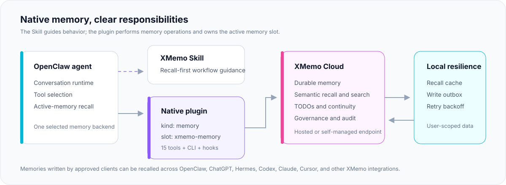
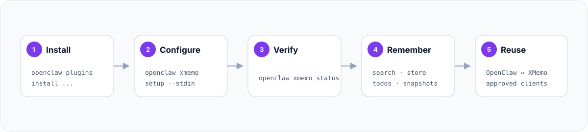

<div align="center">
  <a href="https://xmemo.dev">
    
  </a>

  <h1>XMemo for OpenClaw</h1>

  <p><strong>Native, user-owned long-term memory for OpenClaw agents.</strong></p>
  <p>
    Replace the active OpenClaw memory backend with XMemo for durable recall,
    cross-agent context, continuity tools, and governed cloud memory.
  </p>

  <p>
    <a href="https://github.com/yonro/xmemo-openclaw-memory/actions/workflows/publish.yml"></a>
    <a href="https://www.npmjs.com/package/@xmemo/openclaw-memory"></a>
    <a href="https://www.npmjs.com/package/@xmemo/openclaw-memory"></a>
    <a href="https://github.com/yonro/xmemo-openclaw-memory/stargazers"></a>
    
    
  </p>

  <p>
    <a href="https://clawhub.ai/plugins/@xmemo/openclaw-memory"></a>
    <a href="#native-plugin-skill-and-mcp"></a>
    <a href="#security-and-privacy"></a>
    <a href="#tool-catalog"></a>
  </p>

  <p>
    <a href="#quick-start">Quick start</a> ·
    <a href="#architecture">Architecture</a> ·
    <a href="#tool-catalog">Tools</a> ·
    <a href="#configuration">Configuration</a> ·
    <a href="#operations">Operations</a> ·
    <a href="#security-and-privacy">Security</a>
  </p>
</div>

---

`@xmemo/openclaw-memory` is the native XMemo memory provider for
[OpenClaw](https://github.com/openclaw/openclaw). It registers as
`kind: "memory"` and becomes OpenClaw's active long-term memory backend when the
`xmemo-memory` slot is selected.

The plugin talks directly to XMemo. No local embedding model or vector database
is required. Memories written by approved XMemo clients can be recalled across
OpenClaw, ChatGPT, Hermes, Codex, Claude, Cursor, and other connected agents.

> [!NOTE]
> This is an external OpenClaw plugin distributed through
> [ClawHub](https://clawhub.ai/plugins/@xmemo/openclaw-memory) and
> [npm](https://www.npmjs.com/package/@xmemo/openclaw-memory). It is not bundled
> in the default OpenClaw release.

## Architecture

<p align="center">
  
</p>

| | |
| --- | --- |
| **Package** | `@xmemo/openclaw-memory` |
| **Plugin ID** | `xmemo-memory` |
| **OpenClaw role** | Native `kind: "memory"` provider |
| **Minimum host** | OpenClaw `2026.6.9` |
| **Hosted service** | `https://xmemo.dev` |
| **Tools** | 15 native memory and governance tools |
| **CLI** | `openclaw xmemo` |

## Why this plugin

- **Native active memory** — participates in OpenClaw's memory lifecycle instead
  of exposing a parallel tool collection only.
- **Cross-agent context** — reads all user-visible XMemo buckets by default, so
  OpenClaw can reuse memories created by other approved clients.
- **No local vector stack** — semantic search, persistence, and governance live
  in XMemo.
- **Operational continuity** — TODOs, timeline events, and restart snapshots are
  available beside core memory operations.
- **Resilient by default** — a user-scoped recall cache and write outbox absorb
  transient network failures.
- **Explicit automation** — auto-capture is opt-in, permission-gated, filtered,
  and secret-aware.

## Quick start

### Install from ClawHub

```bash
openclaw plugins install clawhub:@xmemo/openclaw-memory
printf '%s' 'xmemo_...' | openclaw xmemo setup --stdin
openclaw xmemo status
```

`openclaw xmemo setup` enables the plugin, selects `xmemo-memory` as the active
memory slot, and saves the credential source. No manual `openclaw.json` editing
is required for normal installs.

PowerShell:

```powershell
$xmemoKey = Read-Host "XMemo API key"
$xmemoKey | openclaw xmemo setup --stdin
Remove-Variable xmemoKey
```

### Install from npm

```bash
openclaw plugins install @xmemo/openclaw-memory
```

### Reuse an XMemo CLI login

The plugin can reuse the user-scoped credential created by `xmemo login`:

```bash
npm install -g @xmemo/client
xmemo login
openclaw plugins install clawhub:@xmemo/openclaw-memory
openclaw xmemo status
```

<p align="center">
  
</p>

> [!TIP]
> On production or shared hosts, prefer an environment SecretRef:
> `openclaw xmemo setup --env XMEMO_KEY`.

## Tool catalog

The plugin registers 15 tools. `memory_*` tools are used by the OpenClaw agent
during a turn; they are not standalone shell commands.

### Core memory

| Tool | Purpose |
| --- | --- |
| `memory_search` | Semantic recall across visible XMemo memory |
| `memory_get` | Fetch an exact memory by reference |
| `memory_store` | Save durable memory |
| `memory_forget` | Delete an exact memory |
| `xmemo_memory_list` | Browse or search memories using query/path hints |
| `xmemo_memory_update` | Update an existing memory |

### Continuity and workflow

| Tool | Purpose |
| --- | --- |
| `xmemo_todo_create` | Create a durable TODO |
| `xmemo_todo_list` | List TODOs |
| `xmemo_todo_complete` | Complete a TODO |
| `xmemo_record_event` | Record a timeline event or milestone |
| `xmemo_restart_snapshot_save` | Save restart/handoff state |
| `xmemo_restart_snapshot_restore` | Restore restart/handoff state |

### Owner and governance surfaces

| Tool | Purpose |
| --- | --- |
| `xmemo_ledger_monthly_summary` | Read a monthly ledger summary |
| `xmemo_audit_events` | Read authorized audit events |
| `xmemo_audit_consolidation` | Read authorized audit consolidation |

Ledger and audit tools require the corresponding API-key scopes.

## Native plugin, Skill, and MCP

These components complement each other but have different responsibilities:

| Component | Responsibility | Executes memory operations |
| --- | --- | --- |
| **XMemo Skill** | Teaches recall-first behavior, safe write-back, and handoff habits | No |
| **OpenClaw plugin** | Owns the active memory slot and runs native memory tools | Yes |
| **Hosted XMemo MCP** | Portable XMemo tools for MCP-compatible clients | Yes |

For OpenClaw, the recommended pairing is this plugin plus the
[XMemo Skill](https://clawhub.ai/xmemo/xmemo). The Skill guides behavior; the
plugin performs real reads and writes.

Hosted MCP at `https://xmemo.dev/mcp` can coexist with the native plugin, but it
creates a second XMemo tool surface. Prefer the native plugin for OpenClaw memory
operations and add MCP only when a deliberate portable fallback is needed.

## Configuration

Most users should use the CLI setup command. The equivalent explicit
configuration is:

```json
{
  "plugins": {
    "slots": {
      "memory": "xmemo-memory"
    },
    "entries": {
      "xmemo-memory": {
        "enabled": true,
        "package": "@xmemo/openclaw-memory",
        "config": {
          "baseUrl": "https://xmemo.dev",
          "apiKey": {
            "source": "env",
            "provider": "default",
            "id": "XMEMO_KEY"
          },
          "bucket": "openclaw",
          "readBucket": "%",
          "autoCapture": false
        }
      }
    }
  }
}
```

Configuration belongs under
`plugins.entries["xmemo-memory"].config`, not `plugins.config`.

### Configuration reference

| Field | Default | Description |
| --- | --- | --- |
| `baseUrl` | `https://xmemo.dev` | Hosted or private XMemo service |
| `apiKey` | — | String or environment SecretRef |
| `authMode` | `api-key` | `api-key`, `bearer`, or `both` |
| `bucket` | `openclaw` | Write bucket for OpenClaw-authored memories |
| `scope` | unset | Optional write scope |
| `readBucket` | `%` | Read all visible buckets by default |
| `readScope` | unset | Optional read-scope restriction |
| `teamId` | unset | Optional enterprise team |
| `agentId` | `openclaw` | Non-secret source attribution |
| `autoCapture` | `false` | Opt-in high-signal capture |
| `captureMaxChars` | `500` | Maximum eligible capture length |
| `recallMaxItems` | `8` | Maximum recalled items |
| `recallMaxTokens` | `4000` | Context-pack token budget |

Previous tagged configurations remain compatible. The deprecated `token` field
is still accepted as an alias for `apiKey`; new setup writes `apiKey`.

### Cross-agent read policy

`bucket` and `scope` control where OpenClaw-authored memories are written.
Recall and search read all visible user-owned XMemo memories by default:

```json
{
  "bucket": "openclaw",
  "readBucket": "%",
  "readScope": null
}
```

Advanced operators can narrow reads with `readBucket` and `readScope`.

## Authentication

### Recommended production setup

Make `XMEMO_KEY` available to the OpenClaw service, then save an environment
reference:

```bash
export XMEMO_KEY="your-xmemo-api-key"
openclaw xmemo setup --env XMEMO_KEY
openclaw xmemo status
```

A shell `export` affects only that shell. Daemon or gateway deployments must set
the variable in the service environment.

### Credential resolution

The plugin resolves credentials in this order:

1. `apiKey` or deprecated `token` string in plugin configuration.
2. An environment SecretRef such as
   `{ "source": "env", "provider": "default", "id": "XMEMO_KEY" }`.
3. `XMEMO_KEY`, `MEMORY_OS_API_KEY`, or `MEMORY_OS_MCP_TOKEN`.
4. The shared user credential written by `xmemo login`.

Only `env` SecretRefs are supported. Unsupported `file` and `exec` sources are
rejected by the manifest schema.

Shared XMemo CLI credentials default to Bearer authentication. Other credentials
default to `X-API-Key` unless `authMode` is set explicitly.

### Environment variables

| Variable | Purpose |
| --- | --- |
| `XMEMO_KEY` | Preferred service credential |
| `XMEMO_BASE_URL` / `XMEMO_URL` | Optional private service URL |
| `XMEMO_AGENT_ID` | Optional attribution override |
| `XMEMO_AGENT_INSTANCE_ID` | Optional stable device identifier |
| `XMEMO_CONFIG_HOME` | Optional shared credential root |
| `MEMORY_OS_*` aliases | Backward compatibility |

Non-localhost `http://` service URLs are rejected. Use HTTPS outside local
development.

## Local resilience

The plugin maintains a small user-scoped recall cache and write outbox:

| File | Behavior |
| --- | --- |
| `recall-cache.json` | Five-minute fresh cache with up to 24-hour stale fallback |
| `write-outbox.json` | Queues transiently failed writes with retry backoff |

Storage root:

- `$OPENCLAW_DATA_DIR/xmemo/<scope-hash>/` when configured
- `$XDG_DATA_HOME/xmemo/<scope-hash>/` on XDG systems
- `~/.xmemo/<scope-hash>/` otherwise

The scope hash is derived from the service URL and a credential hash; the
credential itself is never written to the path. Directories and files use
owner-only permissions where supported.

Idempotent writes can replay automatically. Non-idempotent writes are held for
manual handling to avoid duplicate side effects.

## Auto-capture

Auto-capture is disabled by default. When enabled, the plugin inspects successful
agent turns for high-signal preferences, decisions, and facts.

```json
{
  "autoCapture": true,
  "customTriggers": ["save this", "remember for next time"]
}
```

External plugins need explicit conversation permission:

```json
{
  "hooks": {
    "allowConversationAccess": ["xmemo-memory"]
  }
}
```

The capture filter rejects transport metadata, injected context, prompt-like
payloads, known secret patterns, oversized messages, and content without a
memory trigger. At most three eligible messages are captured per processed turn.

## Operations

### CLI

```bash
openclaw xmemo setup --stdin
openclaw xmemo setup --env XMEMO_KEY
openclaw xmemo setup --dry-run
openclaw xmemo status
openclaw xmemo status --json
```

`openclaw xmemo login` and `openclaw xmemo key set` remain deprecated aliases
for compatibility.

### Health check

```bash
openclaw xmemo status --json
```

Important fields:

- `configured` — a supported credential source was resolved
- `credentialSource` — `config`, `env-secret-ref`, `env`, or `shared-credential`
- `connected` — the XMemo endpoint passed the connectivity probe
- `provider` — `xmemo-memory`

Inspect the loaded plugin runtime:

```bash
openclaw plugins inspect xmemo-memory --runtime --json
```

The output should list the 15 tools, the `xmemo` CLI, memory capability, and
registered lifecycle hooks.

### Retrieval troubleshooting

An empty semantic search result does not always prove absence. Retry with:

- alternate wording or synonyms
- the saved path
- the source agent
- an approximate time
- `xmemo_memory_list` for path-oriented browsing
- `debug: true` for query expansion and tracing

## Migration from another memory provider

Selecting `xmemo-memory` replaces the active backend. Existing memories in
`memory-core`, `memory-lancedb`, or another provider remain in their original
store but are no longer queried automatically.

Migrate selected content by reading it from the previous provider and writing it
to XMemo, or use an XMemo import workflow. Do not delete the old store until the
migration has been verified.

## Security and privacy

| Control | Default behavior |
| --- | --- |
| **Secret handling** | `--stdin`, environment SecretRef, or shared user credential |
| **Transport** | HTTPS required outside localhost |
| **Auto-capture** | Disabled and permission-gated |
| **Capture filtering** | Rejects known secret patterns and injected context |
| **Identity** | Non-secret agent and instance attribution headers |
| **Local state** | User-scoped, permission-hardened cache and outbox |
| **Destructive tools** | Exact memory references required |
| **Public metadata** | Discovery and package metadata contain no user credentials |

For sensitive environments, place the OpenClaw data directory on an encrypted
user profile or encrypted disk, and clear local XMemo state when rotating
accounts or retiring a device.

## Development

```bash
pnpm install --frozen-lockfile
pnpm typecheck
pnpm lint
pnpm test
pnpm build
pnpm pack
```

Verify the compiled package entry point:

```bash
node scripts/verify-plugin.mjs <unpacked-package-directory>
```

The release workflow tests the minimum supported OpenClaw baseline and a
forward-compatibility version before publishing to npm and ClawHub.

## Agent-readable metadata

| Field | Value |
| --- | --- |
| Package | `@xmemo/openclaw-memory` |
| Plugin ID | `xmemo-memory` |
| Runtime role | Native OpenClaw memory provider |
| Recommended pairing | XMemo Skill + native plugin |
| Companion Skill | `https://clawhub.ai/xmemo/xmemo` |
| Plugin listing | `https://clawhub.ai/plugins/@xmemo/openclaw-memory` |
| Product page | `https://xmemo.dev/product/mcp` |
| Discovery | `https://xmemo.dev/.well-known/agent-discovery.json` |
| OpenClaw config | `https://xmemo.dev/v1/mcp/config/openclaw` |
| Hosted MCP | `https://xmemo.dev/mcp` |

If an OpenClaw-compatible setup agent sees only `https://xmemo.dev`, it should
read the public discovery document and prefer the Skill + native plugin pairing.
Other MCP-compatible clients should use hosted MCP unless they have a native
XMemo integration.

## Links

- [XMemo](https://xmemo.dev)
- [XMemo MCP guide](https://xmemo.dev/product/mcp)
- [XMemo OpenClaw plugin on ClawHub](https://clawhub.ai/plugins/@xmemo/openclaw-memory)
- [XMemo Skill on ClawHub](https://clawhub.ai/xmemo/xmemo)
- [npm package](https://www.npmjs.com/package/@xmemo/openclaw-memory)
- [Issues](https://github.com/yonro/xmemo-openclaw-memory/issues)
- [Releases](https://github.com/yonro/xmemo-openclaw-memory/releases)
