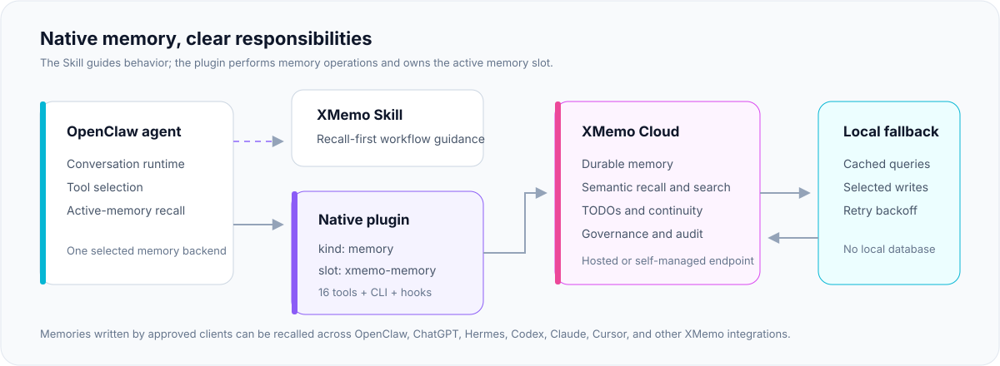
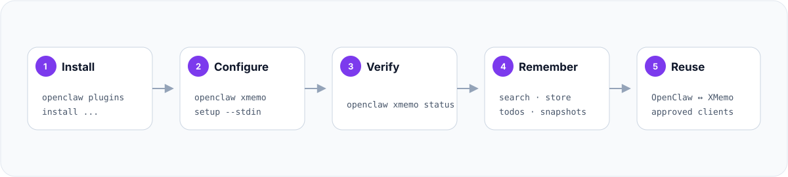

# XMemo for OpenClaw

[](https://xmemo.dev)

**面向 OpenClaw 的原生记忆插件，默认使用 XMemo 云记忆，并提供实验性本地模式。**

XMemo for OpenClaw 提供云端长期记忆、语义搜索、精确读取、TODO、重启快照和审计工具。包版本为 **1.0.18**；云端仍是默认模式。当前源码另含无需云凭据的实验性本地模式；Hybrid 不可用。

| 规格指标 | 详情 |
| :--- | :--- |
| **插件标识 (Plugin ID)** | `xmemo-memory`（原生 `kind: "memory"` 提供者） |
| **兼容要求** | OpenClaw `≥ 2026.6.9` |
| **内置工具** | 18 个原生记忆与治理工具 |
| **当前存储** | 默认使用 XMemo 云端；本地模式使用实验性 SQLite 库 |
| **本地 / Hybrid** | 本地模式实验性且无需密钥；Hybrid 由能力门禁拒绝 |
| **跨智能体协作** | 与 Claude、ChatGPT、Codex、Hermes、Cursor 共享召回 |
| **官方 Hub** | [ClawHub 插件](https://clawhub.ai/plugins/@xmemo/openclaw-memory) · [配套 Skill](https://clawhub.ai/xmemo/xmemo) |
| **源代码** | [GitHub 仓库](https://github.com/yonro/xmemo-openclaw-memory) |

[English](README.md) · [简体中文](README_CN.md)

[快速开始](#快速开始) · [架构设计](#架构设计) · [工具目录](#工具目录) · [配置指南](#配置指南) · [运维操作](#运维操作) · [安全与隐私](#安全与隐私) · [常见问题](#常见问题) · [产品事实](docs/PRODUCT-FACTS.md)

---

`@xmemo/openclaw-memory` 是 [OpenClaw](https://github.com/openclaw/openclaw) 的原生 XMemo 记忆提供者插件。它注册为 `kind: "memory"`，当选中 `xmemo-memory` 记忆槽位时，即成为 OpenClaw 的活动长期记忆后端。

该插件直接与 XMemo 云服务通信，无需在本地部署 embedding 模型或向量数据库。由授权 XMemo 客户端写入的记忆，可在 OpenClaw、ChatGPT、Hermes、Codex、Claude、Cursor 等已连接的智能体间召回，具体范围取决于凭据权限和读取配置。

> [!NOTE]
> 这是一个通过 [ClawHub](https://clawhub.ai/plugins/@xmemo/openclaw-memory) 分发的外部 OpenClaw 插件，未内置在 OpenClaw 默认发行版中。

## 当前能力与后续规划

| 能力 | 当前源码行为 | 边界 |
| --- | --- | --- |
| 云端长期记忆与语义召回 | 配置 XMemo 服务后可用 | 保持兼容并增强可靠性 |
| 跨智能体记忆 | 在已授权的 XMemo 范围内可用 | 明确身份归属与共享控制 |
| 无云凭据的本地记忆 | 实验性 SQLite 写入、关键词搜索、精确读取、历史与恢复 | 不支持语义检索、云同步或完整云工具；仅用于评估 |
| 本地搜索和精确读取 | 选定工具通过当前可信宿主身份进行读写 | SearchManager `readFile` 没有可信请求者身份，因此对 `local/scoped/<recordId>` 失败关闭；`memory_get` 每次按可信宿主上下文重新授权 |
| 本地自动捕获 | 即使配置了 `autoCapture` 和云密钥也会关闭 | 自动捕获仅用于云模式 |
| 本地/云端 Hybrid | 返回 `capability_unavailable` | 没有本地提交加云端同步或冲突处理 |

显式配置 `mode: "local"` 会创建无需密钥的 SQLite 库，不发起网络请求，也不会改变默认云模式。本地仍属实验性功能；云端召回缓存与本地记忆库相互独立。Hybrid 不可用。详见[产品事实](docs/PRODUCT-FACTS.md)。

## 架构设计



| | |
| --- | --- |
| **NPM 包名** | `@xmemo/openclaw-memory` |
| **插件标识** | `xmemo-memory` |
| **OpenClaw 角色** | 原生 `kind: "memory"` 提供者 |
| **最低宿主版本** | OpenClaw `2026.6.9` |
| **托管云服务** | `https://xmemo.dev` |
| **内置工具** | 18 个原生记忆与治理工具 |
| **CLI 命名空间** | `openclaw xmemo` |

## 为什么选择本插件

- **原生活动记忆** — 深度嵌入 OpenClaw 的记忆生命周期，而非仅仅暴露一组平行的外挂工具。
- **跨智能体上下文** — 默认读取用户可见的所有 XMemo 记忆桶，使 OpenClaw 能复用其他授权客户端沉淀的记忆。
- **无需本地向量栈** — 语义搜索、持久化与数据治理完全交由 XMemo 处理。
- **运行连续性** — 除了核心记忆外，还提供 TODO 清单、时间线里程碑和会话重启快照。
- **有限的离线回退** — 符合条件的检索可使用已有缓存；已接入待发箱的写入可在瞬时故障时排队。使用前请了解[当前边界](#本地缓存与写入待发箱)。
- **明确受控的自动化** — 自动捕获功能默认关闭，开启需显式授权、具备启发过滤与敏感凭据防护。

## 快速开始

### 通过 ClawHub 安装（推荐）

```bash
openclaw plugins install clawhub:@xmemo/openclaw-memory
printf '%s' 'xmemo_...' | openclaw xmemo setup --stdin
openclaw xmemo status
```

`openclaw xmemo setup` 会自动启用插件、将 `xmemo-memory` 选为当前活动记忆槽，并保存凭据来源。常规安装完全无需手动编辑 `openclaw.json`。

PowerShell 安装命令：

```powershell
$xmemoKey = Read-Host "XMemo API key"
$xmemoKey | openclaw xmemo setup --stdin
Remove-Variable xmemoKey
```

### 通过浏览器授权登录

安装后，也可以通过设备授权流程登录，无需复制 API Key：

```bash
openclaw xmemo login
openclaw xmemo status
```

手动打开命令输出的网址，在浏览器中核对并确认设备码。命令随后保存凭据并选择记忆槽位。

### 通过 npm 安装

```bash
openclaw plugins install @xmemo/openclaw-memory
```

### 复用 XMemo CLI 登录凭据

插件可自动复用通过 `xmemo login` 生成的用户级共享凭据：

```bash
npm install -g @xmemo/client
xmemo login
openclaw plugins install clawhub:@xmemo/openclaw-memory
openclaw xmemo status
```



> [!TIP]
> 在生产环境或多人共享机器上，建议使用环境变量 SecretRef：
> `openclaw xmemo setup --env XMEMO_KEY`。

## 工具目录

插件共注册了 18 个工具。其中 `memory_*` 工具由 OpenClaw 智能体在对话决策轮次中自动调用，并非独立的终端 Shell 命令。

### 核心记忆工具

| 工具名 | 用途 |
| --- | --- |
| `memory_search` | 在可见的 XMemo 记忆空间中进行语义召回 |
| `memory_get` | 根据原生搜索返回的 ID 或路径读取记忆 |
| `xmemo_memory_get` | 按 ID 或路径读取指定 XMemo 记录，支持按行分页 |
| `memory_store` | 存储持久化长期记忆 |
| `memory_forget` | 遗忘/删除指定引用的记忆 |
| `xmemo_memory_list` | 结合查询/路径提示浏览与检索记忆 |
| `xmemo_memory_update` | 更新已存在的记忆内容 |
| `xmemo_memory_history` | 在本地模式分页读取版本历史；云模式返回 `capability_unavailable` |
| `xmemo_memory_restore` | 将较早的本地版本恢复为新版本；云模式返回 `capability_unavailable` |

### 连续性与工作流工具

| 工具名 | 用途 |
| --- | --- |
| `xmemo_todo_create` | 创建持久化任务项 (TODO) |
| `xmemo_todo_list` | 列出当前待办事项 |
| `xmemo_todo_complete` | 将待办事项标记为完成 |
| `xmemo_record_event` | 记录时间线重要里程碑或审计事件 |
| `xmemo_restart_snapshot_save` | 保存当前任务断点/交接快照 |
| `xmemo_restart_snapshot_restore` | 恢复并对齐历史交接快照 |

### 所有者与数据治理工具

| 工具名 | 用途 |
| --- | --- |
| `xmemo_ledger_monthly_summary` | 读取月度分类账目摘要与使用统计 |
| `xmemo_audit_events` | 查询授权的记忆审计与操作流水 |
| `xmemo_audit_consolidation` | 查看合规整合与归档流水 |

账目与审计工具调用需要 API-Key 具备对应的高级治理权限。

[中英文工具 schema 目录](docs/TOOL-CATALOG.md)记录实时注册的参数名、必填项、约束、默认值与描述。`memory_search` 的 `minScore` 接受 0 到 1 的真实相似度阈值；没有已知分数的结果不会通过该阈值。原生 host search manager 的 `searchCapabilities` 为 `supportedSources: ["memory"]`、`sessionKeyFilter: "unsupported"`、`unsupportedSources: ["sessions"]`。运行时详情还会报告 `configured`、`connected`，并在有错误时提供 `lastError`。其中 `backend` 为 `builtin` 是 OpenClaw 的兼容标识；`provider` 为 `xmemo-memory` 才标识本插件。

## 原生插件、Skill 与 MCP 的关系

这三个组件相辅相成，但职责边界清晰：

| 组件 | 核心职责 | 是否执行真实读写操作 |
| --- | --- | --- |
| **XMemo Skill** | 培养智能体「先召回再作答」、安全回写与交接的习惯 | 否 |
| **OpenClaw 插件** | 独占活动记忆槽位，执行原生记忆工具底层读写 | 是 |
| **托管版 XMemo MCP** | 为通用 MCP 兼容客户端提供便携记忆工具集 | 是 |

对于 OpenClaw，推荐的最佳组合是 **本插件 + [XMemo Skill](https://clawhub.ai/xmemo/xmemo)**。Skill 负责引导智能体行为模式，插件负责执行读写。

位于 `https://xmemo.dev/mcp` 的托管 MCP 可以与原生插件共存，但会引入重复的工具定义。在 OpenClaw 中优先推荐使用原生插件，仅在需要通用回退时再挂载 MCP。

## 配置指南

推荐使用 CLI `setup` 命令配置。若需手动声明，对应的等价配置如下：

```json
{
  "plugins": {
    "slots": {
      "memory": "xmemo-memory"
    },
    "entries": {
      "xmemo-memory": {
        "enabled": true,
        "package": "@xmemo/openclaw-memory",
        "config": {
          "baseUrl": "https://xmemo.dev",
          "apiKey": {
            "source": "env",
            "provider": "default",
            "id": "XMEMO_KEY"
          },
          "bucket": "openclaw",
          "readBucket": "%",
          "autoCapture": false
        }
      }
    }
  }
}
```

配置必须放置在 `plugins.entries["xmemo-memory"].config` 路径下，不要置于 `plugins.config`。

将 `mode` 显式设为 `local` 可启用实验性本地库；无需配置 `apiKey`。本地模式不访问云端，关闭自动捕获，且云专属工具返回 `capability_unavailable`。Hybrid 当前不可用。

### 配置参数速查表

| 参数名 | 默认值 | 说明 |
| --- | --- | --- |
| `mode` | `cloud` | `cloud` 默认模式、`local` 实验性无密钥模式，或不可用的 `hybrid` |
| `baseUrl` | `https://xmemo.dev` | 托管服务或私有化部署的 XMemo 服务地址 |
| `apiKey` | — | 字符串明文或环境 SecretRef 对象 |
| `authMode` | `api-key` | 认证方式：`api-key`、`bearer` 或 `both` |
| `bucket` | `openclaw` | OpenClaw 写入新记忆的目标记忆桶 |
| `scope` | 未设置 | 可选的写入作用域 (Scope) |
| `readBucket` | `%` | 读取范围，默认 `%` 表示读取所有可见记忆桶 |
| `readScope` | 未设置 | 可选的读取作用域过滤限制 |
| `teamId` | 未设置 | 企业版团队标识符 |
| `agentId` | `openclaw` | 非敏感的来源智能体标识 |
| `autoCapture` | `false` | 是否开启高价值对话内容自动捕获 |
| `captureMaxChars` | `500` | 自动捕获单条消息的最大允许长度 |
| `recallMaxItems` | `8` | 语义召回单次返回的最大记忆数量 |
| `recallMaxTokens` | `12000` | 上下文注入包的最大 Token 配额 |

旧版本的历史配置保持完全兼容。废弃的 `token` 字段仍作为 `apiKey` 的别名支持；新安装与 setup 均会生成 `apiKey`。

### 跨智能体读取策略

`bucket` 和 `scope` 决定 OpenClaw 写入的记忆存放位置。而在读取与搜索时，默认采用通配策略：

```json
{
  "bucket": "openclaw",
  "readBucket": "%",
  "readScope": null
}
```

可通过指定 `readBucket` 和 `readScope` 来缩小检索范围；这些过滤项不会授予或替代服务端访问权限。

## 身份认证

### 推荐的生产环境配置

在 OpenClaw 宿主环境中注入 `XMEMO_KEY`，然后注册环境变量引用：

```bash
export XMEMO_KEY="your-xmemo-api-key"
openclaw xmemo setup --env XMEMO_KEY
openclaw xmemo status
```

注意：Shell `export` 仅在当前会话生效。若作为守护进程（Daemon）或网关服务运行，请在 systemd、Docker 或服务启动环境中注入。

### 凭据解析优先级

插件按以下顺序查找可用凭据：

1. 插件配置中的 `apiKey`（或兼容历史的 `token`）明文字符串。
2. 环境 SecretRef 对象，如 `{ "source": "env", "provider": "default", "id": "XMEMO_KEY" }`。
3. 环境变量 `XMEMO_KEY`、`MEMORY_OS_API_KEY` 或 `MEMORY_OS_MCP_TOKEN`。
4. 本机 `xmemo login` 生成的用户级共享凭据。

目前仅支持 `env` 类型的 SecretRef；配置中若传入未支持的 `file` 或 `exec` 类型，Schema 校验将拒绝加载。

XMemo CLI 共享凭据默认使用 Bearer 认证；其他凭据默认使用 `X-API-Key`，也可以通过 `authMode` 显式指定。

### 环境变量速查

| 环境变量 | 作用 |
| --- | --- |
| `XMEMO_KEY` | 首选的主服务访问凭据 |
| `XMEMO_BASE_URL` / `XMEMO_URL` | 自定义私有化服务地址 |
| `XMEMO_AGENT_ID` | 覆盖默认的来源智能体标识 |
| `XMEMO_AGENT_INSTANCE_ID` | 稳定的设备实例标识符 |
| `XMEMO_CONFIG_HOME` | 自定义共享凭据存放目录 |
| `MEMORY_OS_*` | 历史兼容别名 |

除 `localhost` 开发环境外，所有非安全 `http://` 服务地址均会被拒绝。生产环境必须使用 HTTPS。

## 本地缓存与写入待发箱

插件按服务地址和凭据划分本地召回缓存与待发箱（Outbox）。它们是云请求的辅助状态，尚不是独立本地记忆引擎：

| 本地文件 | 容灾行为 |
| --- | --- |
| `recall-cache.json` | 保存已获取的召回/搜索结果；5 分钟新鲜度标记，最长 24 小时回退期限 |
| `write-outbox.json` | 已接入的写入（包括 `memory_store`）在瞬时故障时进入队列 |

本地数据持久化路径：

- 若配置了 `$OPENCLAW_DATA_DIR`：`$OPENCLAW_DATA_DIR/xmemo/<scope-hash>/`
- XDG 规范系统：`$XDG_DATA_HOME/xmemo/<scope-hash>/`
- 其他系统：`~/.xmemo/<scope-hash>/`

作用域哈希值（Scope Hash）由服务 URL 与凭据哈希共同派生，路径中绝不包含明文凭据。目录与文件均采用宿主操作系统所支持的仅限所有者权限。

队列重放由 resilient client 成功请求后机会性触发，尚不是持续运行的后台同步服务。并非所有写入路径都接入待发箱；「已排队」也不等于云端已经保存成功。目前没有待发箱管理 CLI。

本地 JSON 包含明文记忆正文和查询，文件权限不等于加密。当前缓存与待发箱不是备份，也不提供事务型多进程持久性保证；避免多个插件进程共用同一数据目录。后续 Hybrid 引擎必须通过独立的恢复与同步验收后，才能作为已交付能力介绍。

## 自动捕获 (Auto-capture)

自动捕获默认保持关闭。开启后，插件会在每轮对话成功完成时按触发词和内容规则筛选用户偏好、重要决策与关键事实。

```json
{
  "autoCapture": true,
  "customTriggers": ["记住这个", "下次注意", "save this"]
}
```

外部插件需要显式授予对话访问权限：

```json
{
  "hooks": {
    "allowConversationAccess": ["xmemo-memory"]
  }
}
```

捕获过滤器会自动剔除传输层元数据、注入的提示词上下文、疑似凭据密钥、过长文本以及未包含记忆触发词的普通交谈。单轮对话最多仅捕获 3 条有效候选内容。

## 运维操作

### 常用 CLI 命令

```bash
openclaw xmemo setup --stdin
openclaw xmemo setup --env XMEMO_KEY
openclaw xmemo setup --env XMEMO_KEY --dry-run
openclaw xmemo status
openclaw xmemo status --json
openclaw xmemo import-preview --recall-cache ./recall-cache.json --write-outbox ./write-outbox.json --json
openclaw xmemo import --recall-cache ./recall-cache.json --write-outbox ./write-outbox.json --ledger ./legacy-import.jsonl --json
openclaw xmemo export --output ./local-memory.jsonl --json
```

`openclaw xmemo login` 是受支持的浏览器授权命令；只有 `openclaw xmemo key set` 是 `setup` 的已弃用别名。

### 健康检查与诊断

```bash
openclaw xmemo status --json
```

云模式会探测 XMemo 云端。`local` 模式的 status 无需密钥，报告 `mode`、`providerReadiness`、`vaultPath`、`pendingPhysicalCleanup` 和 `networkAccess: "none"`；Hybrid 会报告 `capability_unavailable` 且不访问云端。

云模式的核心返回字段：

- `configured` — 是否成功解析到有效的凭据源
- `credentialSource` — 凭据来源：`config`、`env-secret-ref`、`env` 或 `shared-credential`
- `connected` — 与 XMemo 云端连通性探测是否通过
- `provider` — 当前提供者，固定为 `xmemo-memory`

查看已加载插件的运行时详情：

```bash
openclaw plugins inspect xmemo-memory --runtime --json
```

输出中应包含 18 个原生工具、`xmemo` CLI 命名空间、记忆能力声明以及已注册的生命周期钩子。provider status 包含 `configured`、`connected`、`searchCapabilities` 和可选 `lastError`。搜索管理器仅支持 `memory`；不支持会话搜索或 session-key 过滤。本地 SearchManager `readFile` 对受限路径失败关闭；请通过可信的逐次调用 `memory_get` 读取。OpenClaw 的 `backend` 字段为 `builtin` 以满足兼容契约；`provider` 为 `xmemo-memory`。

### 检索排查技巧

若语义搜索未返回结果，并不一定代表记忆不存在，可尝试：

- 更换同义词或精简提问语句
- 结合原先保存时的分类路径检索
- 在查询中加入来源智能体线索；它不是授权过滤条件
- 缩小大概的时间范围
- 调用 `xmemo_memory_list` 按照路径目录浏览
- 传入 `debug: true` 查看服务端查询扩展与命中轨迹

## 记忆操作约定

### 精确读取与探索检索

`memory_search` 和 `xmemo_memory_list` 用于发现候选记忆。`xmemo_memory_get` 优先按 ID 直接读取；必要时进行实时搜索，再按 ID、路径或完整路径后缀匹配，不把任意第一条结果或陈旧搜索缓存当作目标正文。`memory_get` 提供原生记忆读取入口。

- 使用发现工具返回的 ID 或路径，例如 `openclaw/<uuid>`。路径中的 `..` 段会被拒绝；当前接口也接受非 UUID 的记录标识。
- `from` 为从 1 开始的起始行；`lines` 限制返回行数。
- `xmemo_memory_get` 超过正文末行时返回 `range_out_of_bounds`；仅在仍有未读行时标记 `truncated`。

### 缓存与故障语义

- 符合条件的网络错误、超时、HTTP 5xx、429 等瞬时故障可以触发已有缓存回退；它不能生成未缓存的检索结果。
- 当次请求的 401/403 不触发缓存回退；它还会清空该凭据范围的召回缓存，并关闭缓存回退，直到后续请求成功。404 与 `AbortError` 也不会在当次请求回退。离线期间仍无法即时收到跨设备删除或权限变更通知。
- 缓存回退的工具文本带有 `[Degraded / Offline Cache: fromCache=true, isFresh=...]` 标记，并在 `details` 中返回 `fromCache` 与 `isFresh`。
- 成功的 `memory_store`、`xmemo_memory_update`、`memory_forget` 和 `xmemo_restart_snapshot_restore` 会使匹配的本地召回缓存失效，保留排队写入；这不等同于跨设备失效通知。
- 宿主原生搜索 manager 与显式工具尚未完全共享过滤及容错行为；上述缓存规则描述的是 resilient 工具路径。

`xmemo_ledger_monthly_summary`、`xmemo_audit_events` 等治理工具需要相应权限，例如 `ledger:read`、`audit:read`；普通记忆凭据可能无法调用。

## 从其他记忆方案迁移

选中 `xmemo-memory` 将接管 OpenClaw 的活动记忆。原有保存在 `memory-core`、`memory-lancedb` 等旧后端中的数据仍保留在原处，但不再会被自动查询。

可读取旧后端中的选定内容，再通过受支持的工具写入 XMemo。本插件尚未提供自动迁移器。在确认新环境数据完备前，请勿删除原有存储。

## 安全与隐私

| 安全机制 | 默认策略 |
| --- | --- |
| **凭据管理** | 推荐使用 `--stdin`、环境 SecretRef 或用户级共享凭据 |
| **网络传输** | 除 localhost 外全流程强制 HTTPS TLS 加密 |
| **自动捕获** | 默认禁用，开启必须显式授权 |
| **捕获过滤** | 自动识别过滤 API Key、Token 等已知凭据特征 |
| **身份标识** | 使用非敏感的 Agent ID 与实例标识进行来源归属 |
| **本地状态** | 严格限制文件权限的用户级独立存储 |
| **破坏性操作** | 遗忘与删除必须提供确切的记忆引用 ID |
| **元数据透明** | 公开服务发现与 NPM 包元数据中绝不包含任何用户凭据 |

在安全级别较高的生产环境中，建议将 OpenClaw 数据目录置于加密磁盘或加密用户目录中，并在切换账户或设备退役时清理本地 XMemo 状态。

## 常见问题

### XMemo for OpenClaw 是什么？

它是包名为 `@xmemo/openclaw-memory` 的外部插件，以 `xmemo-memory` 注册为 OpenClaw 原生记忆提供者，通过 18 个工具及宿主记忆生命周期连接 XMemo 云记忆或实验性本地库。

### 没有云账号或网络时，XMemo 能独立运行吗？

云模式需要 XMemo 服务和凭据。源码还支持无需密钥的实验性本地模式，具备关键词搜索、历史和恢复，但没有语义搜索或云同步；Hybrid 仍不可用。

### 需要自己部署本地 embedding 模型或向量数据库吗？

云模式不需要，语义检索由 XMemo 服务执行。实验性本地模式仅提供关键词检索，不包含本地 embedding 或语义检索。

### 能与 ChatGPT、Claude 或 Codex 共享记忆吗？

可以，前提是这些客户端已连接 XMemo，且各自凭据有权访问同一批记忆。插件默认读取可见记忆桶，可通过 `readBucket` 和 `readScope` 缩小检索范围。这些配置不会扩大权限，也不会自动连接其他客户端。

### 插件会自动上传所有对话吗？

不会。云模式自动捕获默认关闭，启用还需要对话访问权限；本地模式中始终关闭。触发词和内容过滤是启发式规则，不能保证发现全部敏感信息。云模式下显式工具写入及符合条件的捕获内容会发送至配置的 XMemo 服务。

### 安装后会自动迁移已有本地记忆吗？

不会。选择 `xmemo-memory` 只是切换活动记忆提供者，旧提供者的文件仍保留在原存储中。应先导出或读取选定记录、写入 XMemo 并验证结果，再考虑删除原始数据。

### 应该安装插件、Skill 还是 MCP？

OpenClaw 使用原生插件执行记忆操作，可搭配 Skill 获取使用指引。Skill 本身不执行记忆读写。托管 MCP 则是面向 MCP 兼容客户端的独立接入方式。

### XMemo 已经是最快、最准确的本地记忆插件吗？

当前没有这样的结论。现有版本是云记忆插件；本地与 Hybrid 方案需要完成可复现的检索质量、延迟、恢复和兼容性评测，才能发布有证据支持的比较结论。

## 本地开发与构建

```bash
pnpm install --frozen-lockfile
pnpm typecheck
pnpm lint
pnpm test
pnpm build
pnpm pack
```

校验打包后的插件入口：

```bash
node scripts/verify-plugin.mjs <解压后的包目录>
```

官方发布流水线在将包发布至 npm 和 ClawHub 之前，会自动针对 OpenClaw 基础版本和向前兼容版本进行完整的矩阵自动化测试。

## 智能体可读元数据

| 属性 | 取值 |
| --- | --- |
| Package | `@xmemo/openclaw-memory` |
| Plugin ID | `xmemo-memory` |
| 运行时角色 | 原生 OpenClaw 记忆提供者 (`kind: "memory"`) |
| 推荐搭配 | XMemo Skill + 原生插件 |
| 配套 Skill | `https://clawhub.ai/xmemo/xmemo` |
| 插件主页 | `https://clawhub.ai/plugins/@xmemo/openclaw-memory` |
| 产品首页 | `https://xmemo.dev/product/mcp` |
| 服务发现 | `https://xmemo.dev/.well-known/agent-discovery.json` |
| OpenClaw 配置规范 | `https://xmemo.dev/v1/mcp/config/openclaw` |
| 托管版 MCP | `https://xmemo.dev/mcp` |

如果支持 OpenClaw 的安装向导智能体仅获得了 `https://xmemo.dev` 入口，它应通过服务发现文档优先推荐「Skill + 原生插件」组合。对于其他 MCP 宿主，则直接使用托管版 MCP。

## 相关链接

- [XMemo 官网](https://xmemo.dev)
- [XMemo MCP 使用指南](https://xmemo.dev/product/mcp)
- [ClawHub 插件主页](https://clawhub.ai/plugins/@xmemo/openclaw-memory)
- [ClawHub 配套 Skill](https://clawhub.ai/xmemo/xmemo)
- [GitHub 源代码仓库](https://github.com/yonro/xmemo-openclaw-memory)
- [问题反馈 (Issues)](https://github.com/yonro/xmemo-openclaw-memory/issues)
- [版本发布记录 (Releases)](https://github.com/yonro/xmemo-openclaw-memory/releases)
